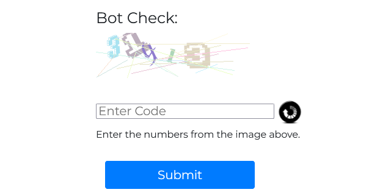
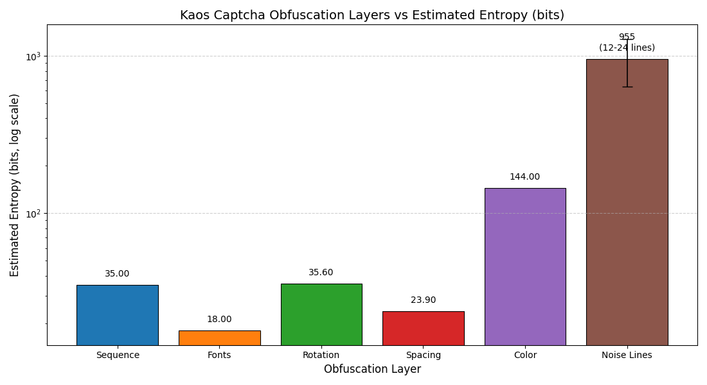

# Kaos Captcha Generator

A robust, highly resilient CAPTCHA generator designed to resist automated OCR and AI-based solving attempts. This script produces randomized numeric captchas with multiple obfuscation layers, including rotation, color variation, spacing irregularities, varied fonts, and noise lines.

It is suitable for web applications where **strong anti-bot protection** is required while remaining readable to human users.



---

## Features

* Generates 5-digit numeric captchas.
* Randomized fonts for each digit (8 included).
* Per-digit rotation between -30° and +30°.
* Random horizontal spacing between digits.
* Fully randomized RGB color per digit.
* 18 random noise lines per captcha with random color and position.
* Dependencies: PHP 7+ and GD library.

---

## Obfuscation and Security Analysis

This captcha script has been designed with **entropy and OCR resistance** in mind. The following breakdown demonstrates how each obfuscation layer contributes to overall resilience:


### 1. Random Digit Sequence

* Each captcha has 5 digits (0–9), giving **10 possibilities per digit**.
* Entropy formula: `H = log2(N^L) = L * log2(N)`
* Calculated entropy: `H_digits = 5 * log2(10) ≈ 16.61 bits`
* Baseline entropy comes from the numeric sequence alone.

---

### 2. Font Variability

* 8 fonts randomly selected for each digit.
* Entropy per digit: `log2(8) ≈ 3 bits`
* For 5 digits: `H_fonts = 5 * 3 = 15 bits`

---

### 3. Rotation

* Each digit randomly rotated between -30° and +30° (61 possibilities).
* Entropy per digit: `log2(61) ≈ 5.93 bits`
* For 5 digits: `5 * 5.93 ≈ 29.65 bits`

---

### 4. Color Variation

* Random RGB values per digit (256 possibilities per channel → 24 bits)
* Entropy for all digits: `H_color = 5 * 24 = 120 bits`
* Adds complexity for OCR tools that rely on uniform contrast.

---

### 5. Horizontal Spacing Variability

* Random spacing ±10 pixels between digits → 21 possibilities per gap
* Entropy per gap: `log2(21) ≈ 4.39 bits`
* For 4 gaps: `4 * 4.39 ≈ 17.56 bits`

---

### 6. Noise Lines

* 18 random lines with random positions and colors
* Positions: 260×90 pixels → ~23,400 possibilities per line
* Combined entropy per line: `log2(23,400^2) + 24 ≈ 53.07 bits`
* Total for 18 lines: `18 * 53.07 ≈ 955.26 bits`
* **Primary obstacle for automated solvers**, as lines interfere with segmentation and OCR.

---

### 7. Total Approximate Entropy

* Sum of all layers: `H_total ≈ 16.61 + 15 + 29.65 + 120 + 17.56 + 955.26 ≈ 1153.1 bits`
* Ignoring color and noise lines: `16.61 + 15 + 29.65 + 17.56 ≈ 78.8 bits`
* **>78 bits is highly resistant** to off the shelf OCR or AI attacks.

---

### 8. Testing Methodology

The generator was rigorously tested using a **tiered Python OCR testing suite**, with difficulty levels ranging from basic thresholding to advanced segmentation and line-inpainting techniques:

* **Easy**: Grayscale + Otsu thresholding
* **Medium**: Denoising + adaptive thresholding + morphological operations
* **Hard**: Line removal + color clustering + thresholding
* **Expert**: Full pipeline with segmentation, inpainting, and fallback OCR

#### Results

* **Kaos Captchas**: **100% OCR failure rate** across hundreds of generated images and multiple retries. No test or variation has solved a single captcha
* **Other captchas** (white background, black digits, no obfuscation - tested as a control to validate results of Kaos Captcha tests): **100% OCR success rate** across all difficulty levels.

---

### 9. Interpretation

* **Line noise and color variability** are the most effective defenses.
* **Rotation, fonts, and spacing** further impede automated segmentation.
* Combined, the captcha is **effectively unreadable by standard OCR** without bespoke model training.
* Theoretical maximum entropy (~1153 bits) ensures **robust security against automated attacks**.

---

# **Installation and Usage Instructions — CAPTCHA Installer**

The `install_captcha.php` script generates a **site-specific** `captcha.php` file containing randomized visual parameters and a font selection list.  
This approach ensures that each deployment’s CAPTCHA instance is unique and resistant to signature-based bypasses.

---

## **1. Prerequisites**

1. **PHP CLI** must be available.  
   Confirm by running:
   ```bash
   which php
   ```
   If PHP is not found, use the full path to your PHP binary (for example, `/opt/plesk/php/8.3/bin/php`).

2. Ensure the **target directory** (the web application’s root or form handler directory) is:
   - Writable by the user executing the script
   - Accessible by your web server (e.g., Apache, NGINX, or Plesk’s PHP handler)

3. Install the **GD extension** (required for image generation):
   ```bash
   php -m | grep gd
   ```
   If not found, install it using your package manager or enable it in Plesk’s PHP settings.

4. Optionally, create a `fonts/` directory in your target path and add `.ttf` files to it.  
   If fewer than eight fonts are found, public fallback fonts will be listed in the output.

---

## **2. Setting Up CAPTCHA_PEPPER**

`CAPTCHA_PEPPER` is an environment variable used to introduce installation-specific entropy.  
It ensures that random values (e.g., digit placement, color distribution, and rotation) differ per deployment and cannot be easily predicted or cloned.

### Example (Linux/Plesk):
Add to your environment configuration, such as `/etc/environment`:
```
CAPTCHA_PEPPER="your-long-random-secret"
```

Then reload the environment (or restart the web server):
```bash
source /etc/environment
```

This 48-character secret is sufficient and cryptographically sound for this purpose.

---

## **3. Running the Installer**

Execute from the command line:

```bash
php install_captcha.php /path/to/target/dir
```

**Example (Plesk environment):**
```bash
/opt/plesk/php/8.3/bin/php install_captcha.php /var/www/vhosts/example.com/httpdocs/
```

**Expected output:**
```
Generated /var/www/vhosts/example.com/httpdocs/captcha.php with randomized parameters.
Fonts used (update your 'fonts/' folder with these names if needed):
 - DejaVuSans-Bold.ttf
 - LiberationSans-Bold.ttf
 ...
```

---

## **4. Verifying Installation**

After installation:
- The file `/path/to/target/dir/captcha.php` should exist.
- Open `https://example.com/captcha.php` in a browser — it should render a CAPTCHA image.
- If the image fails to render, check:
  - PHP GD extension is enabled.
  - Correct permissions on the `fonts/` and `white.jpg` files (if used).
  - Error logs (`/var/log/plesk-phpXX-fpm/error.log`).

---

## **5. Using the CAPTCHA**

### **In your HTML form:**
```html
<form method="post" action="form_handler.php">
  
  <input type="text" name="captcha" placeholder="Enter code shown above">
  <input type="submit" value="Submit">
</form>
```

### **In your form handler (form_handler.php):**
```php
<?php
session_start();
if (isset($_POST['captcha'], $_SESSION['captcha'])) {
    if ($_POST['captcha'] === $_SESSION['captcha']) {
        echo "Captcha valid – proceeding with form submission.";
    } else {
        echo "Invalid captcha. Please try again.";
    }
    unset($_SESSION['captcha']);
} else {
    echo "Captcha missing or expired.";
}
?>
```

---

## **6. Regenerating or Resetting CAPTCHA**

You can safely regenerate the site-specific CAPTCHA (for example, after updating font files or changing the pepper) by rerunning the installer:

```bash
php install_captcha.php /path/to/target/dir
```

This overwrites the previous `captcha.php` with new randomized parameters.

---

## **7. Security Notes**

- **Never commit** the generated `captcha.php` file to public repositories.  
  It contains installation-specific randomization parameters that should remain private.
- Ensure that your pepper is stored securely and not exposed in any logs or web-accessible files.
- Regenerate the CAPTCHA occasionally to vary its characteristics further.

---

## General Notes

* **Line noise and color variation** are the strongest defenses against OCR.
* **Rotation, fonts, and spacing** add additional segmentation resistance.
* The script is designed to **resist even advanced, multi-tiered automated attacks**.

---

## License

This project is licensed under the **GNU General Public License (GPL v3)** - free to use, modify, and redistribute under the same license.

---

## Security Considerations

* Resistant to off-the-shelf OCR, AI-based solvers, and segmentation attacks.
* Ensure **HTTPS** is used to prevent interception of captcha images.
* Rate-limit login endpoints to prevent brute-force attacks, even with strong captchas.

---

## Contributing

* Submit font files or new obfuscation methods for testing.
* Pull requests are welcome to add additional noise types or alternative background images.


